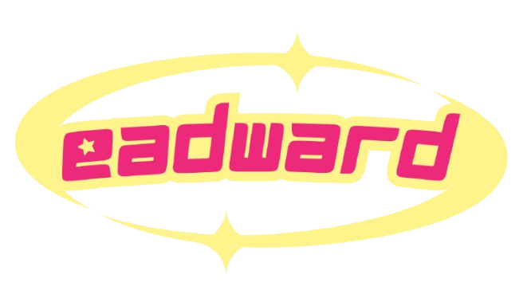

<a name="readme-top">

 

 

  <a href="https://github.com/eadwardandrei/">
  <!-- TODO: If you want to add logo or banner you can add it here -->
    
  </a>
<!-- TODO: Change Title to the name of the title of your Project -->
  <h3 align="center">FEU Tech Student Leaderboards</h3>

<!-- TODO: Make a short description -->

  This website is created for the academic professors of Far Eastern University Institute of Technology, where they can input their students' necessary details such as student number, name, section, and GWA. The website gives them the ability to sort these details ascendingly or descendingly according to their needs.

 

<!-- TODO: Change the zyx-0314 into your github username  -->
<!-- TODO: Change the WD-Template-Project into the same name of your folder -->

---

 
 

<!-- TODO: If you want to add more layers for your readme -->

  
Table of Contents

  <ol>
    <li>
      <a href="#overview">Overview</a>
      <ol>
        <li>
          <a href="#key-components">Key Components</a>
        </li>
        <li>
          <a href="#technology">Technology</a>
        </li>
      </ol>
    </li>
    <li>
      <a href="#rule,-practices-and-principles">Rules, Practices and Principles</a>
    </li>
    <li>
      <a href="#resources">Resources</a>
    </li>
  </ol>

---

## Overview

<!-- TODO: To be changed -->
<!-- The following are just sample -->
This web-based system keeps track of student performance by allowing users to add, view, sort, and delete student records based on their General Weighted Average (GWA). It functions as a leaderboard where students with the best GWAs can be ranked.

### Key Components
<!-- TODO: List of Key Components -->
<!-- The following are just sample -->
- Add Student Records 
Professors can input student details such as Student No., Name, Section, GWA.

- Display Leaderboard Table 
The table dynamically updates whenever a student is added or removed.

- Professors can click on table headers to sort records by:
  1. Student Number (Numerical & Alphabetical Order)
  2. Name (Alphabetically)
  3. GWA (Ascending or Descending)
  > Professors can also remove student entries.

- The table updates instantly after deletion.
- User-Friendly Design 

### Technology
<!-- TODO: List of Technology Used -->

## Resources

<!-- TODO: Add References -->
| Title | Purpose | Link |
|-|-|-|
| FEU Tech Logo | For the header | https://en.wikipedia.org/wiki/Far_Eastern_University_Institute_of_Technology |
